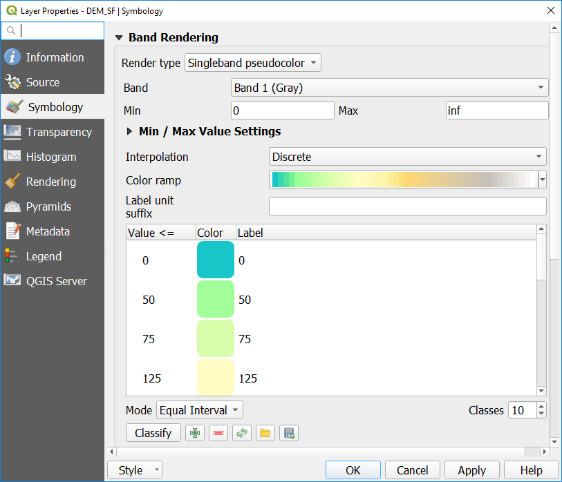
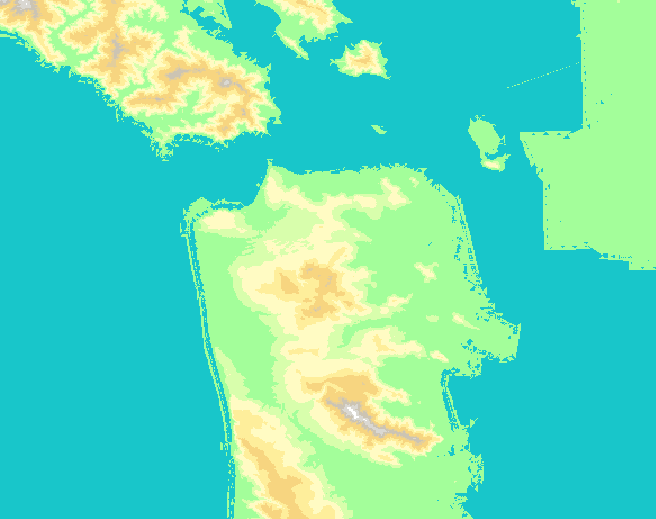

# Working with Raster Data

Let's start by looking at some Raster data.  We'll work with a digital elevation model (DEM) for San Francisco.  A DEM is a raster in which each cell in the grid contains the elevation at that location.

For now, let's turn off all of the layers in the *Layers* panel except for the *DEM_SF* layer by unchecking the boxes next to the layer names in the *Layers* Panel on the left side of your screen.

Now you should see a gray scale image that roughly looks like the San Francisco peninsula.  This is a Digital Elevation Model (DEM).  Each cell in the raster contains a number representing the elevation at that location.  

Let's style this data:

1. Open the *Layer Styling* Panel by clicking on the *View* menu, then *Panels*, and checking the box for *Layer Styling*.
1. At the top of the panel that opens, select the DEM from the drop-down menu, or highlight that layer in the *Layers* panel.
1. Click on the *Symbology* tab on the left side (the icon looks like a paintbrush painting a rainbow).
1. For the *Render type* drop down (just below where you selected the layer), select *Singleband pseudocolor*.
1. Expand the *Min/Max Value Settings" area.  In the *Statistics extent* drop-down, select *Whole raster*.  For *Accuracy*, select *Actual (slower)*.
1. For the *Color ramp*, select *Create new color ramp*
1. Select *Catalog: cpt-city* from the drop down and click *Ok*
1. Pick *Topography* from the options on the left.
1. Pick *cd-a* for our gradient.  Or select another scheme you think will work well for representing topography.  Click *Ok*.
1. You'll see that the color ramp in the Layers Properties has updated.  Click *Apply* to see what it looks like with our data or check the box next to *Live update* to apply changes as you make them.

Chances are, this isn't exactly what you want and we can make some more improvements to see the shoreline and topography better.  

1. In the *Layer Styling* panel again, for the *Interpolation* drop-down, select *Discrete*.
1. For the *Mode*, select *Equal Interval*. For *Classes*, input 10.
1. Change the *Value* number for the lowest category to 0 by double clicking on the default number and typing in the number 0 and pressing enter on your keyboard.  If it doesn't automatically update, click *Apply* in the Layer Properties to see how it looks.  You should see a more defined coastline that looks more like the docks around the city.
1. Continue to adjust the colors and/or breaks until you are happy with how it looks, then click *Ok*.  (See the image below for one option.)

I chose breaks at 0, 50, 75, 125, 175, 225, 275, 325, 350, and inf.

In the event that you need to reset your classes to start over with modifying your classes, click the *Classify* button again.

Note: In case you need to know, in our DEM data, the Min value is -9.36748 and the Max value is 399.963.  You can reset this if you need to by selecting the *Min/max* radio button in the *Min/Max Value Settings* again.

Now you've had a first look at how to style raster data for better viewer understanding.  There is a wide variety of analysis and data processing that we can't learn today in our limited time.  For more on working with raster data, see the [Raster Module of the QGIS Training Manual](https://docs.qgis.org/3.10/en/docs/user_manual/working_with_raster/index.html).
