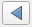

# Working with Vector Data
Now let's learn about working with vector data.  In the *Layers* panel, turn off the DEM and turn on the streets layer.  Notice that the streets are represented with lines.

## Single Symbol Styling
Your street layer is loaded by default with a randomly selected color.  Let's start our vector work by changing the styling of our streets to something more appropriate.  

1. If your *Layer Styling* panel isn't still open, reopen it from the *View* menu by selecting *Panels* and then checking the box next to *Layer Styling*.
1. Make sure the drop-down to select the layers to work with is set to your streets data.
1. Leave the drop-down for selecting the method of symbolizing the data on *Single symbol*.  We'll look at some of the other options later.
1. In the white box near the top, you'll see the word *Line* and *Simple line*.  Click on the words *Simple line*.  This will let us access lots of options for how to symbolize this set of lines.
1. In the *Color* box, click on the colored box to open the color selection dialog.
1. The color selection dialog has multiple options for how you select your colors.  Take a minute to get a feel for how each of these works.  I find each of these has advantages for certain situations.
1. Choose a color that you think represents roads well.  I used a dark gray.  You can enter *#666666* into the *HTML notation* box to use the same color if you'd like.  
1. Once you've picked a color, use the *Go Back* button to return to the main dialog. 

## Attributes tables
Vector data is typically made of up of two parts: (1) the points, lines, or polygons that represent real-world entities called the **geometry** and (2) information about those entities, typically in table format, called **attributes**.

Let's look at the attribute table for our streets:
1. In the *Layers* panel, right click on the streets layer and select *Open Attribute Table*.
1. Scroll to the right to explore the information in this table.  We have information like the name of the street, whether or not it's a one-way street, and the name of the neighborhood it's in.
1. Each row in this table is linked to a street in our data set.  Click on the row number of any row.  The program will automatically highlight this street in the map canvas HOWEVER, many of these streets are small so we might not see it right away.  We can zoom to the selected row by clicking the *Zoom map to selected row* button. 
1. Minimize the attribute table, and use the zoom in and out tools  to adjust your view.  The *Pan* tool can also help navigate.   
1. You can clear the selection (make nothing selected) with the *Deselect Features* tool.    This tool just makes nothing selected, it doesn't delete data.
1. If you'd like to zoom to see all of the streets data, right click on the streets layer in the *Layers* panel and select *Zoom to layer(s)*.

## Select by attributes
Selecting streets by hand is helpful, but depending on what we want to do, we might want an automated way to select the streets that we want to highlight.  Let's investigate the *classcode* column.

1. In the attribute table for the streets layer, click on the *Select features using an expression*  to open the *Select by Expression* tool.
1. We'll build an expression in the white box on the left side of the tool.  In the center panel, expand the *Fields and Values* list.
1. Double click the *classcode* field to add it to the expression box on the left.  
1. Then click the *=* button to add an equal sign to the equation.
1. We can also click the *All Unique* button on the right to see all of the values that are found in the *classcode* column.  I don't recommend using this option on continuous data; it's best for categorical data with a relatively small number of unique values.  Click *'1'* in the list.  Note that while we think of the items in this list as numbers, this column was likely defined as text, so this is why the numbers are wrapped in quotes.  If we tried to use the number without the quotes, the GIS would find no matches because it would be looking for the number 1, not the text 1.  Your expression should look like *"classcode"  =  '1'*. If QGIS read the *classcode* field as numbers, your expression should look like this: *"classcode"  =  1*  **NOTE: in QGIS 3.24, both options work.**
1. Click *Select features*.  You'll notice that rows in the attribute table and lines on the map have been highlighted.  What do you think a *classcode* of 1 means?

**Challenge:** Try changing the expression to select different *classcode* categories.  What do you think each category means?  

You can review the metadata/data dictionary on the About tab on the [data's homepage](https://data.sfgov.org/Geographic-Locations-and-Boundaries/San-Francisco-Basemap-Street-Centerlines).  1 Freeways; 2 Highways; 3 Major Streets; 4 Secondary Streets; 5 Local Streets; 6 Freeway Ramps; 0 Private Streets

Selecting our data based on the attribute information is a good way to explore and understand data, but it is only a temporary way to highlight data.  To use differences in attribute data in a map, we'll need to work with the layer symbology.

## Symbolizing layers by attributes

### Classifying Attributes
Let's style this street data based on the kind of street.  This will be a good visualization for giving context to some of the other data we have to work with.

1. Clear out any selections you may still have with the *Deselect Features* tool.   
1. In the *Layer Styling* panel, pick the street data from the dropdown list so we are working with this data.  
1. Instead of *Single symbol*, pick *Categorized* from the dropdown menu near the top of the dialog. (Don't worry if the data disappears.)
1. For the *Value* dropdown, pick the *classcode* column so we can use this data for our categories.
1. Click the *Classify* button to see our categories.  

Ok! We can see each road classified by it's *classcode*.  The colors will default to *Random Colors* for the palette. We can change the colors to meet our needs and communicate better.  Let's use the width of the line rather than color to indicate the type of road.
1. You can uncheck the last row in the list of symbols.  This category is for data with no *classcode*.
1. Select all of the symbol levels in the list of symbols by selecting the first row and then the last row while holding down the shift key.
1. Right click on the highlighted symbols and choose *Change Color*.
1. Pick a gray color.  I used *HTML code* #a0a0a0.  Click *Apply*.  All of the roads will now be the same gray color.  Remember that our goal is to vary the widths of the lines based on the type of road.
1. Click the *Go Back* button  to return to the main window.

To guide our work, let's change the text of the legend.  For each legend item, double click on the label and change the number label to the following text:

Value | Legend
--- | ---
0| Private Streets
1| Freeways
2| Highways
3| Major Streets
4| Secondary Streets
5| Local Streets
6| Freeway Ramps

Next we'll change the line width (also known as the line weight).
1. For each row in the legend, double click on the line symbol to open the *Symbol Selector* dialog.
1. Change the *Width* to match the Line Weight in the table below.

Value | Legend | Line Weight
--- | --- | ---
0| Private Streets | 0.26
1| Freeways | 2.0
2| Highways | 2.0
3| Major Streets | 1.0
4| Secondary Streets | 0.26
5| Local Streets | 0.26
6| Freeway Ramps | 0.5

 

### Rule-Based Symbology
We've just seen how we can use an automated classification method to change the symbology of data.  Now let's look at how we can build rules based on attributes to create tailored symbology.  The street tree layer has many, many tree locations - too many to make a useful map of all the trees so we'll need to select a subset of the data to include.  

Here's a real-world scenario for us to think about: in recent years, a number of non-native bark beetles have been introduced to California.  These beetles can damage and kill trees.  Let's make a map of one species of tree that might be affected, Canary Pine (*Pinus canariensis*), to investigate their spatial distribution and think about where you might want to concentrate monitoring efforts.  The [UC IPM site](http://ipm.ucanr.edu/PMG/PESTNOTES/pn7421.html) has more information about bark beetle species and tree species affected by them.

Let's look at rule-based symbology:
1. In the *Layer Styling* panel, select the street tree data.
1. Select *Rule-Based* from the drop-down menu for the symbology method.
1. Click the green + button (near the bottom) to add a rule.
1. In the *Label* box, type "Canary Pine".  This will give our new rule a name we can easily understand.
1. Next to the *Filter* box, click on the *Expression* button  to open the *Expression String Builder* dialog.  This should look familiar - it's very similar to how we selected rows by their attributes earlier.
1. Add the *qSpecies* field to the expression window from the *Fields & Values* list.
1. Next, type the word *LIKE*.  *LIKE* is a comparison operator for strings.  You might think of this as = for text.
1. Finally, we need to say which species we want.  You may have noticed that the species column typically contains a long string with several pieces of information.  We can search for a portion of the text by using a wildcard character to match part of the string in the column.  Type *'%Pinus canariensis%'* after *LIKE* in your expression.  The single quotes indicate that the words we just typed are a string (and not another variable or field from the attribute table) and the *%* means "it doesn't matter what text is here".  So the program will search for rows that contain the sting *Pinus canariensis*, regardless of what else the column says.
1. Your expression string should look like this: *"qSpecies" LIKE '%Pinus canariensis%'*  Click *OK* when you are done.
1. In the *Rule Editing* dialog, you can also make changes to the color, size, and shape.
1. Click the back button when you are done. 
1. You may need to uncheck the box next to the *(no filter)* rule to see the results of our *Canary Pine* filter.

Based on where the Canary Pines are in the city, where would you want to focus your monitoring efforts?  Are there places you think might be impacted more quickly if a bark beetle came to the city?

**Challenge:** Choose another species to add to your map.  Add another rule-based classification with a different map symbol.

To learn more about processing and analyzing vector data, see the [QGIS Training Manual's Module on Vector Analysis](https://docs.qgis.org/2.18/en/docs/training_manual/vector_analysis/index.html).  To learn about creating vector data, see the [QGIS Training Manual's Module on Creating Vector Data](https://docs.qgis.org/2.18/en/docs/training_manual/create_vector_data/index.html).
