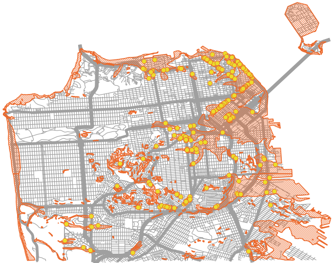

# Select by Location
So far, we've seen analysis that relies mainly on cartographic choices.  There are many other kinds of analysis we could do.  Let's look at an example where we need to undertand the spatial relationship between two different layers: identify large trees inside areas designated as earthquake hazard zones.

One way to measure the size of a tree is by measuring the width of the trunk, about 4 feet off the ground. This measurement is called the *Diameter at Breast Height* or *DBH* for short.  The street tree data has a column in the attribute table called DBH so we can use this to identify the larger trees.

First, let's use the *Select By Attributes* process we learned earlier today to select trees with a DBH of 36 inches or larger.  A quick reminder of the process: open the attribute table and use the query tool to write a query.  *Hint:* We can write "greater than or equal to" as *>=* in the selection interface.

Because the street tree dataset is so large, let's save our large tree selection as a new file to make processes run faster with this subset of the data.  Now that you have the trees with a DBH of 3 feet or more selected:

1. Right click on the layer in the *Layers Panel*.  
1. Select *Export* from the menu that pops up and then *Save selected features as*.  
1. For the format, choose *ESRI Shapefile*, or any of the vector formats you prefer (I personally like geojson because it's one text file, but geopackage is also pretty handy... KML is only a good choice if you're going to use the file in a Google application).
1. Next to the *File Name* box, click the "..." button to pick a folder to save the file in and give the file a name.  I called my "LargeTrees".  Click *Save* when you're done.
1. Make sure the *Save only Selected Features* and *Add saved file to map* boxes are checked, then click *OK*.
1. You should have a file with only the features we had previously selected.
1. You can uncheck the full street trees layer in the *Layers Panel*.

Now we can find which of the large trees are inside seismic hazard zones:

1. On the *Vector* menu, select *Research Tools* and then *Select by Location* to open the *Select by Location* tool.
1. Select features from *Large Trees*, that *Intersect* the *Seismic Hazards* layer and create a new selection.
1. Click *Run*.

The large trees that fall inside the seismic hazard zones are now selected.  But how do we record this information in a way that we can keep and use in a map?  Let's add a column with this information in our attribute table:

1. Open the attribute table for the large trees layer.
1. Click on the *Field Calculator* button.  
1. Check the box next to "Only update selected features" at the top of the window.
1. Name your new field "EarthQZone" so we remember what information it contains.
1. For the field type, select *Text*.
1. In the expression field, type *'yes'*.  This will add the word "yes" to the EarthQZone column where the record is currently selected.
1. Click *OK* and then inspect your attribute table to see the new column.
1. When we started the Field Calculator, QGIS automatically turned on editing for our shapefile.  Save the edits we made by clicking the Save Edits button (blue floppy disk on the attribute table) and turn off the editing mode by clicking the Toggle Editing Mode button (yellow pencil).
1. You can now clear your selection because the attribute information now contains the information we need.

Use your new symbology skills to syle this layer to show which large trees are in seismic hazard zones. Hint: Rule-based or Categorized symbology are good options!

