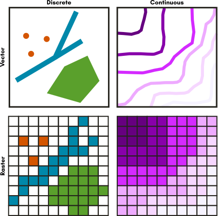

# Introduction
This tutorial uses QGIS 3 to teach the basics of desktop mapping software for beginners with no previous mapping experience.

This workshop has been taught on multiple occasions, some of which have video recordings you can watch:

- April 30, 2019 with QGIS 3.4 [UC Davis DataLab YouTube Channel](https://www.youtube.com/watch?v=avscRlskV2E&t=1s)
- April 14, 2020 with QGIS 3.12 [UC Davis DataLab YouTube Channel](https://www.youtube.com/watch?v=XnabNKLop7c)
- July 17, 2020 with QGIS 3.14 [QGIS North America YouTube Channel](https://www.youtube.com/channel/UCLQd1MsyWWPoIi6rNLUCjhg)
- November 16, 2021 with QGIS 3.16
- April 12, 2022 with QGIS 3.24

## Workshop Preparation
You should download and install [QGIS](https://qgis.org) version 3.24 (long term release) or higher to your computer.

The data we'll use in this workshop is available in this [Box Folder Online](https://ucdavis.box.com/s/cnlz6ejmje4qgf7z80h7ygbwydc65kkm).

## Workshop Aims
This introductory-level workshop will focus upon the fundamental concepts and skills needed to explore and analyze data using Geographic Information Systems (GIS) software with examples using the QGIS platform. 

### Prerequisites
No prior experience with QGIS or other GIS software is needed, though attendees should be comfortable learning new computer applications, working with the basics of spreadsheets, and managing, organizing, and moving computer files on their operating system. 

### Learning Objectives
By the end of this workshop, you will be able to:

- Define GIS and geospatial concepts and terminology.
- Know the difference between vector and raster data types
- Properly connect and add data to a QGIS project
- Know where to find the attributes of your data in QGIS
- Perform basic selections and queries in QGIS
- Symbolize data by attributes
- Assemble a basic map for export

# What is GIS?
GIS stands for either Geographic Information System or Geographic Information Science, depending on what aspect of the term we are interested in.

Geographic Information **System** typically refers to the software, like QGIS, we use to create spatial data and to investigate spatial relationships between that data.

Geographic Information **Science** is the framework we use to ask questions about the spatial relationship between data.

It's good to understand the difference, but you'll rarely hear people distinguish between the two.  We'll do both today - work with the software and ask questions about the spatial relationships in our chosen datasets.

# What is QGIS?
From the [QGIS](https://qgis.org) website, "QGIS is a user friendly Open Source Geographic Information System (GIS) licensed under the GNU General Public License. QGIS is an official project of the Open Source Geospatial Foundation (OSGeo). It runs on Linux, Unix, Mac OSX, Windows and Android and supports numerous vector, raster, and database formats and functionalities."

Let's unpack some of that.  

**QGIS is a desktop GIS.**  That means you get a program that opens up on your computer as a window with buttons you can click, forms you can fill out to do tasks, and it's generally a visual interactive experience (as opposed to commandline programming in a terminal). Often this kind of interface is called a Graphical User Interface or GUI (often pronounced "gooey") for short.

**QGIS is open source.**  That means the code is available for you to read or modify, should you choose to, but you don't have to.  What's the advantage of this?  It means anyone can make fixes if something is wrong or anyone can add new features.  You don't have to wait for a paid developer to add something.  

**QGIS is an official project of the [Open Source Geospatial Foundation (OSGeo)](https://www.osgeo.org/).**  "The Open Source Geospatial Foundation (OSGeo) is a not-for-profit organization whose mission is to foster global adoption of open geospatial technology by being an inclusive software foundation devoted to an open philosophy and participatory community driven development."  OSGeo supports and assists open source geospatial projects providing infrastructure and organization as well as conferences and means of communication with the broader public and education.

# Why QGIS?

[QGIS](https://www.qgis.org) is an open source, community-driven desktop GIS software that allows users to visualize and analyze spatial data in a variety of ways.  There are many reasons to use QGIS, but here are a few: 

- It's a robust, powerful desktop GIS
- Runs on all major platorms: Mac, Linux, & Windows
- Free of charge, all access (no paid add-ons or extensions)
- Frequent updates & bug fixes
- Responsive, enthusiastic community
- Integration with other geospatial tools & programming languages like R, Python, & PostGIS
- Access to analysis tools from other established software like GRASS and SAGA
- Native access to open data formats like geoJSON & GeoPackage
- Comes in [more than 40 languages](https://www.qgis.org/en/site/getinvolved/translate.html), making it easier to work with a larger variety of colaborators
- Growing use by local, state, federal, and international governments

# Data Types - Vector vs. Raster vs. other types of spatial data
There are several data spatial data models that you may encounter as you work with spatial data.  The two you will likely encounter most frequently are called vector and raster data. 

## Vector Data
Vector data represents discrete objects in the real world with points, lines, and polygons in the dataset. 

If you were to draw a map to your house for a friend, you would typically use vector data - roads would be lines, a shopping center included as an important landmark might be a rectangle of sorts, and your house might be a point (perhaps represented by a star or a house icon).

## Raster Data
Raster data represents continuous fields or discrete objects on a grid, storing measurements or category names in each cell of the grid.

Digital photos are raster data you are already familiar with.  If you zoom in far enough on a digital photo, you'll see that photo is made up of pixels, which appear as colored squares.  Pixels are cells in a regular grid and each contains the digital code that corresponds to the color that should be displayed there.  Satellite images are a very similar situation.

# Download data
In this workshop, we'll be using the following data: 

1. Digital Elevation Model (DEM) of San Francisco 
1. Streets
1. Trees
1. Seismic Hazard Zones
1. City of San Francisco Boundary (shoreline)

You can download all of this data from this [Box Folder Online](https://ucdavis.box.com/s/cnlz6ejmje4qgf7z80h7ygbwydc65kkm). Use the *Download* button in the upper right corner of the screen to download a zipped file containing all of the workshop data (sometimes you'll need to dismiss a message at the top of the screen before you can see the download button). Unzip the file to a location on your computer that you can find later.

# Start QGIS & Open a New Project
Start QGIS in the way you typically open any program on your particular computer's operating system.  It's normal that it may take a minute to open.

When QGIS opens, you may see a list of recent projects, or if this is a new installation, there may not be any listed.  It doesn't matter which you see, because we want to start a new project.  To do this, click on the *Project* menu in the upper left of the window and select *New* - or you can click the white page icon that is usually near the *Project* menu on the tool bar.

# Import data into QGIS
Let's load some data.

##  Raster Data
Let's start by loading the raster data:

1. Click on the *Open Data Source Manager* button on your toolbar.  It looks like three cards (one red, one yellow, and one blue) fanned out. Or, find it on the *Layer* menu.
1. Click the *Raster* button (it looks like a checker board) on the left side of the *Data Source Manager* window.
1. Click on the "..." button in the *Source* section in the middle of the window. Navigate to where you saved your workshop data and select the *DEM_SF.tif* file.
3. Click *Open*.
4. Some options will appear on the page. We can leave the defaults for this dataset.
5. Finally, click "Add" and you should see a black and white raster image appear in the map canvas below the dialog you're working in. If the *Select Transformation* dialog pops up, select a transformation you feel fits the data well. I'd recommend *NAD83 to WGS 84 (43)* because the table of options says this one has a high accuracy and is intended for California north of 36.5 degrees north, which fits our data.

You can leave the *Data Source Manager* window open so we can add some more data.

## Vector
### Shapefiles
Shapefiles are a very popular vector data format, so that's what we'll work with today, but geopackage is a good open format alternative (and has the advantage of being just one file).  Let's load our shapefile data:

1. In the *Data Source Manager*, click on the *Vector* tab on the left.
1. In the *Source* section, click on the "..." and navigate to the folder containing your vector data.
1. Holding down the Ctrl button on your keyboard while you click, select the *StreetCenterlines.shp*, *SeismicHazardZones.shp*, and *Shoreline.shp* (don't worry about the other files that make up a shapefile - QGIS will know to look for these when you specify the .shp file).  Then click *Open*. 
1. In the *Options* section, you can leave the default values as they are for this data. Make note of what options are there - the *ENCODING* section is particularly helpful if your attributes are written in a different character set than the default, UTF-8.
1. In the *Data Source Manager* click *Add*. If the *Select Transformation* dialog appears, pick a transformation that fits the data, such as *NAD83 to WGS 84 (43)*.

### CSV Data
It's pretty common to get point data in "CSV" file, especially if the spatial data is represented by latitude and longitude coordinates.  CSV stands for Comma Separated Value.  Typically this is tabular data where the edge of each cell of the table is indicated by a comma.  Sometimes people use a different character instead of the comma such as a semicolon, tab, or pipe. The character used to indicate the edge of the cells is called the "delimiter".  If a file has tabs as the delimeter, for example, you would call that file a "tab delimited" file.

To load our .csv file:

1. In the *Data Source Manager*, click on the *Delimited Text* tab on the left.  Notice that the icon is a comma.
1. Next to the *File Name* text box, click the "..." button, then navigate to your *Street_Tree_Map.csv* file and click *Open*.
1. In the *File format* section, we'll leave the default selection of *CSV (comma separated values)*, but if you had a file with a different delimiter, you could change the delimiter by using *Custom delimiters*.
1. In the *Records and Fields Options* section, make sure *First record has field names* is checked.  If your data didn't have table headings, you would want to uncheck this box. You can also check *Detect field types*.
1. In the *Geometry definition* section is where we indicate what kind of geometry we have.  For ours, select *Point coordinates* and in the *X field*, pick "Longitude", and for the *Y field* pick "Latitude".
1. For the *Geometry CRS*, click on the *Select CRS* button (it looks like a little globe wearing a cone-shaped hat). In the *Filter*, type 4326 to find and select *WGS 84*.
1. Review the *Sample data* section to preview how the attribute table will look.  This is a good way to find out if you picked the right delimiter or if your data has some formatting issues (such as someone put commas in a text field and use commas as the delimiter).
1. If everything looks good, click *Add*.  This is a reasonably large file, so be patient as it loads.
1. Close the *Data Source Manager* window because we are done adding data.

# Saving Project Files
Now that we've added data to our project, let's save it so we can come back to it later.  

1. Click on the blue floppy disk icon (or from the *File* menu, select *Save*).
1. Navigate to where you want to save your project file. 
1. In the *File name* box, type the name you would like your file to have.  Give it a descriptive name so you'll remember what the file was for.
1. Click *Save*.

Note for ESRI users: QGIS' .qgs and .qgz file are analogous to ArcMap's .mxd files.

# Working with Raster Data

Let's start by looking at some Raster data.  We'll work with a digital elevation model (DEM) for San Francisco.  A DEM is a raster in which each cell in the grid contains the elevation at that location.

For now, let's turn off all of the layers in the *Layers* panel except for the *DEM_SF* layer by unchecking the boxes next to the layer names in the *Layers* Panel on the left side of your screen.

Now you should see a gray scale image that roughly looks like the San Francisco peninsula.  This is a Digital Elevation Model (DEM).  Each cell in the raster contains a number representing the elevation at that location.  

Let's style this data:
1. Open the *Layer Styling* Panel by clicking on the *View* menu, then *Panels*, and checking the box for *Layer Styling*.
1. At the top of the panel that opens, select the DEM from the drop-down menu, or highlight that layer in the *Layers* panel.
1. Click on the *Symbology* tab on the left side (the icon looks like a paintbrush painting a rainbow).
1. For the *Render type* drop down (just below where you selected the layer), select *Singleband pseudocolor*.
1. Expand the *Min/Max Value Settings" area.  In the *Statistics extent* drop-down, select *Whole raster*.  For *Accuracy*, select *Actual (slower)*.
1. For the *Color ramp*, select *Create new color ramp*
1. Select *Catalog: cpt-city* from the drop down and click *Ok*
1. Pick *Topography* from the options on the left.
1. Pick *cd-a* for our gradient.  Or select another scheme you think will work well for representing topography.  Click *Ok*.
1. You'll see that the color ramp in the Layers Properties has updated.  Click *Apply* to see what it looks like with our data or check the box next to *Live update* to apply changes as you make them.

Chances are, this isn't exactly what you want and we can make some more improvements to see the shoreline and topography better.  

1. In the *Layer Styling* panel again, for the *Interpolation* drop-down, select *Discrete*.
1. For the *Mode*, select *Equal Interval*. For *Classes*, input 10.
1. Change the *Value* number for the lowest category to 0 by double clicking on the default number and typing in the number 0 and pressing enter on your keyboard.  If it doesn't automatically upadte, click *Apply* in the Layer Properties to see how it looks.  You should see a more defined coastline that looks more like the docks around the city.
1. Continue to adjust the colors and/or breaks until you are happy with how it looks, then click *Ok*.  (See the image below for one option.)

I chose breaks at 0, 50, 75, 125, 175, 225, 275, 325, 350, and inf.

In the event that you need to reset your classes to start over with modifying your classes, click the *Classify* button again.

Note: In case you need to know, in our DEM data, the Min value is -9.36748 and the Max value is 399.963.  You can reset this if you need to by selecting the *Min/max* radio button in the *Min/Max Value Settings* again.

Now you've had a first look at how to style raster data for better viewer understanding.  There is a wide variety of analysis and data processing that we can't learn today in our limited time.  For more on working with raster data, see the [Raster Module of the QGIS Training Manual](https://docs.qgis.org/3.10/en/docs/user_manual/working_with_raster/index.html).

# Working with Vector Data
Now let's learn about working with vector data.  In the *Layers* panel, turn off the DEM and turn on the streets layer.  Notice that the streets are represented with lines.

## Single Symbol Styling
Your street layer is loaded by default with a randomly selected color.  Let's start our vector work by changing the styling of our streets to something more appropriate.  

1. If your *Layer Styling* panel isn't still open, reopen it from the *View* menu by selecting *Panels* and then checking the box next to *Layer Styling*.
1. Make sure the drop-down to select the layers to work with is set to your streets data.
1. Leave the drop-down for selecting the method of symbolizing the data on *Single symbol*.  We'll look at some of the other options later.
1. In the white box near the top, you'll see the word *Line* and *Simple line*.  Click on the words *Simple line*.  This will let us access lots of options for how to symbolize this set of lines.
1. In the *Color* box, click on the colored box to open the color selection dialog.
1. The color selection dialog has multiple options for how you select your colors.  Take a minute to get a feel for how each of these works.  I find each of these has advantages for certain situations.
1. Choose a color that you think represents roads well.  I used a dark gray.  You can enter *#666666* into the *HTML notation* box to use the same color if you'd like.  
1. Once you've picked a color, use the *Go Back* button to return to the main dialog. 

## Attributes tables
Vector data is typically made of up of two parts: (1) the points, lines, or polygons that represent real-world entities called the **geometry** and (2) information about those entities, typically in table format, called **attributes**.

Let's look at the attribute table for our streets:
1. In the *Layers* panel, right click on the streets layer and select *Open Attribute Table*.
1. Scroll to the right to explore the information in this table.  We have information like the name of the street, whether or not it's a one-way street, and the name of the neighborhood it's in.
1. Each row in this table is linked to a street in our data set.  Click on the row number of any row.  The program will automatically highlight this street in the map canvas HOWEVER, many of these streets are small so we might not see it right away.  We can zoom to the selected row by clicking the *Zoom map to selected row* button. 
1. Minimize the attribute table, and use the zoom in and out tools  to adjust your view.  The *Pan* tool can also help navigate.   
1. You can clear the selection (make nothing selected) with the *Deselect Features* tool.    This tool just makes nothing selected, it doesn't delete data.
1. If you'd like to zoom to see all of the streets data, right click on the streets layer in the *Layers* panel and select *Zoom to layer(s)*.

## Select by attributes
Selecting streets by hand is helpful, but depending on what we want to do, we might want an automated way to select the streets that we want to highlight.  Let's investigate the *classcode* column.

1. In the attribute table for the streets layer, click on the *Select features using an expression*  to open the *Select by Expression* tool.
1. We'll build an expression in the white box on the left side of the tool.  In the center panel, expand the *Fields and Values* list.
1. Double click the *classcode* field to add it to the expression box on the left.  
1. Then click the *=* button to add an equal sign to the equation.
1. We can also click the *All Unique* button on the right to see all of the values that are found in the *classcode* column.  I don't recommend using this option on continuous data; it's best for categorical data with a relatively small number of unique values.  Click *'1'* in the list.  Note that while we think of the items in this list as numbers, this column was likely defined as text, so this is why the numbers are wrapped in quotes.  If we tried to use the number without the quotes, the GIS would find no matches because it would be looking for the number 1, not the text 1.  Your expression should look like *"classcode"  =  '1'*. If QGIS read the *classcode* field as numbers, your expression should look like this: *"classcode"  =  1*  **NOTE: in QGIS 3.24, both options work.**
1. Click *Select features*.  You'll notice that rows in the attribute table and lines on the map have been highlighted.  What do you think a *classcode* of 1 means?

**Challenge:** Try changing the expression to select different *classcode* categories.  What do you think each category means?  

You can review the metadata/data dictionary on the About tab on the [data's homepage](https://data.sfgov.org/Geographic-Locations-and-Boundaries/San-Francisco-Basemap-Street-Centerlines).  1 Freeways; 2 Highways; 3 Major Streets; 4 Secondary Streets; 5 Local Streets; 6 Freeway Ramps; 0 Private Streets

Selecting our data based on the attribute information is a good way to explore and understand data, but it is only a temporary way to highlight data.  To use differences in attribute data in a map, we'll need to work with the layer symbology.

## Symbolizing layers by attributes

### Classifying Attributes
Let's style this street data based on the kind of street.  This will be a good visualization for giving context to some of the other data we have to work with.

1. Clear out any selections you may still have with the *Deselect Features* tool.   
1. In the *Layer Styling* panel, pick the street data from the dropdown list so we are working with this data.  
1. Instead of *Single symbol*, pick *Categorized* from the dropdown menu near the top of the dialog. (Don't worry if the data disappears.)
1. For the *Value* dropdown, pick the *classcode* column so we can use this data for our categories.
1. Click the *Classify* button to see our categories.  

Ok! We can see each road classified by it's *classcode*.  The colors will default to *Random Colors* for the palette. We can change the colors to meet our needs and communicate better.  Let's use the width of the line rather than color to indicate the type of road.
1. You can uncheck the last row in the list of symbols.  This category is for data with no *classcode*.
1. Select all of the symbol levels in the list of symbols by selecting the first row and then the last row while holding down the shift key.
1. Right click on the highlighted symbols and choose *Change Color*.
1. Pick a gray color.  I used *HTML code* #a0a0a0.  Click *Apply*.  All of the roads will now be the same gray color.  Remember that our goal is to vary the widths of the lines based on the type of road.
1. Click the *Go Back* button  to return to the main window.

To guide our work, let's change the text of the legend.  For each legend item, double click on the label and change the number label to the following text:

Value | Legend
--- | ---
0| Private Streets
1| Freeways
2| Highways
3| Major Streets
4| Secondary Streets
5| Local Streets
6| Freeway Ramps

Next we'll change the line width (also known as the line weight).
1. For each row in the legend, double click on the line symbol to open the *Symbol Selector* dialog.
1. Change the *Width* to match the Line Weight in the table below.

Value | Legend | Line Weight
--- | --- | ---
0| Private Streets | 0.26
1| Freeways | 2.0
2| Highways | 2.0
3| Major Streets | 1.0
4| Secondary Streets | 0.26
5| Local Streets | 0.26
6| Freeway Ramps | 0.5

 

### Rule-Based Symbology
We've just seen how we can use an automated classification method to change the symbology of data.  Now let's look at how we can build rules based on attributes to create tailored symbology.  The street tree layer has many, many tree locations - too many to make a useful map of all the trees so we'll need to select a subset of the data to include.  

Here's a real-world scenario for us to think about: in recent years, a number of non-native bark beetles have been introduced to California.  These beetles can damage and kill trees.  Let's make a map of one species of tree that might be affected, Canary Pine (*Pinus canariensis*), to investigate their spatial distribution and think about where you might want to concentrate monitoring efforts.  The [UC IPM site](http://ipm.ucanr.edu/PMG/PESTNOTES/pn7421.html) has more information about bark beetle species and tree species affected by them.

Let's look at rule-based symbology:
1. In the *Layer Styling* panel, select the street tree data.
1. Select *Rule-Based* from the drop-down menu for the symbology method.
1. Click the green + button (near the bottom) to add a rule.
1. In the *Label* box, type "Canary Pine".  This will give our new rule a name we can easily understand.
1. Next to the *Filter* box, click on the *Expression* button  to open the *Expression String Builder* dialog.  This should look familiar - it's very similar to how we selected rows by their attributes earlier.
1. Add the *qSpecies* field to the expression window from the *Fields & Values* list.
1. Next, type the word *LIKE*.  *LIKE* is a comparison operator for strings.  You might think of this as = for text.
1. Finally, we need to say which species we want.  You may have noticed that the species column typically contains a long string with several pieces of information.  We can search for a portion of the text by using a wildcard character to match part of the string in the column.  Type *'%Pinus canariensis%'* after *LIKE* in your expression.  The single quotes indicate that the words we just typed are a string (and not another variable or field from the attribute table) and the *%* means "it doesn't matter what text is here".  So the program will search for rows that contain the sting *Pinus canariensis*, regardless of what else the column says.
1. Your expression string should look like this: *"qSpecies" LIKE '%Pinus canariensis%'*  Click *OK* when you are done.
1. In the *Rule Editing* dialog, you can also make changes to the color, size, and shape.
1. Click the back button when you are done. 
1. You may need to uncheck the box next to the *(no filter)* rule to see the results of our *Canary Pine* filter.

Based on where the Canary Pines are in the city, where would you want to focus your monitoring efforts?  Are there places you think might be impacted more quickly if a bark beetle came to the city?

**Challenge:** Choose another species to add to your map.  Add another rule-based classification with a different map symbol.

To learn more about processing and analyzing vector data, see the [QGIS Training Manual's Module on Vector Analysis](https://docs.qgis.org/2.18/en/docs/training_manual/vector_analysis/index.html).  To learn about creating vector data, see the [QGIS Training Manual's Module on Creating Vector Data](https://docs.qgis.org/2.18/en/docs/training_manual/create_vector_data/index.html).

# Making a map with the print composer
One common task in any desktop GIS is to produce a map to include in a document or presentation.  In QGIS we create maps in the *Print Composer*.  Let's make a finished map of our tree locations.

## Prepare your Layers
The first thing we need to do is add all the layers we want in our finished map to our Map Canvas in the main QGIS window.  Turn on your trees and roads layers and add in any other data you think will help support the tree locations such as the shoreline data.

We also need to style our layers here as well.  Take some time to work with your layer symbology.  Make choices that you feel help communicate the data well.  Simple or plain choices are often better than complicated or fancy symbology.  For example, you could use a tree-shaped icon to represent your trees, but this would probably make a rather busy map.  A simple circle icon might be better.

Just get to a point where you have a solid draft.  We can always make changes later if we decide we need to adjust.

## Working in the Print Composer
Once you've added all the layers you need to your Map Canvas and styled them in a way you like, we can start composing our map.

1. Open the *Print Composer* by clicking on the *Project* menu and choosing *New Print Layout*.
1. Give your new Print Layout a name.  I'll call mine "Canary Pine Locations".  You can have multiple map layouts using the data in this map document, so pick a name that will remind you of the purpose of this map.  Click *OK* when you've picked a name. The *Print Composer* will now open.
1. The white box in the middle of the window is where you will compose your map.  Right click in this white space and choose *Page Properties* from the menu that appears.  The menu on the right will now let us adjust the page size and orientation.  Let's use size *Letter* and *Landscape* orientation for this map.  
1. Add a map to your layout by clicking the *Add Map* tool and then clicking and dragging on your map layout.   You can adjust the size so don't worry if it's not perfect at first.  The *Move Item* tool moves and adjusts items in your map.  
1. Adjust the scale of your map by selecting your map.  In the *Item Properties* on the right, adjust the scale number to zoom in or out of your map data.  I used a scale of about 40,000.
1. Add other items to your map as needed: title, legend, scale bar, etc. The item properties for each item you add are available by selecting the item and editing the properties in the pane on the right side of the *Print Composer* window.
1. When you've made a layout you like, you can export the map to a variety of formats.  On the *Layout* menu, select *Save as Image*.  Navigate to where you would like to save the image, name the file, and choose the type of image.  Let's pick .png for this image.  Click *Save*.
1. Make any adjustments to the image parameters you would like.  Click *Save* to finish the process.
1. When you're finished exporting your map, you can close the *Print Composer* window.

Your map might look something like this.  I added an *Outer Glow* in the *Draw Effects* menu to the Shoreline data to achieve the fading blue outline.

You may want to add background layers such as coastlines or land masses from data sources like:
* [Natural Earth Data](http://naturalearthdata.com/)
* [Project Linework](http://www.projectlinework.org/)
* [GADM](https://gadm.org/)

# Select by Location
So far, we've seen analysis that relies mainly on cartographic choices.  There are many other kinds of analysis we could do.  Let's look at an example where we need to undertand the spatial relationship between two different layers: identify large trees inside areas designated as earthquake hazard zones.

One way to measure the size of a tree is by measuring the width of the trunk, about 4 feet off the ground. This measurement is called the *Diameter at Breast Height* or *DBH* for short.  The street tree data has a column in the attribute table called DBH so we can use this to identify the larger trees.

First, let's use the *Select By Attributes* process we learned earlier today to select trees with a DBH of 36 inches or larger.  A quick reminder of the process: open the attribute table and use the query tool to write a query.  *Hint:* We can write "greater than or equal to" as *>=* in the selection interface.

Because the street tree dataset is so large, let's save our large tree selection as a new file to make processes run faster with this subset of the data.  Now that you have the trees with a DBH of 3 feet or more selected:
1. Right click on the layer in the *Layers Panel*.  
1. Select *Export* from the menu that pops up and then *Save selected features as*.  
1. For the format, choose *ESRI Shapefile*, or any of the vector formats you prefer (I personally like geojson because it's one text file, but geopackage is also pretty handy... KML is only a good choice if you're going to use the file in a Google application).
1. Next to the *File Name* box, click the "..." button to pick a folder to save the file in and give the file a name.  I called my "LargeTrees".  Click *Save* when you're done.
1. Make sure the *Save only Selected Features* and *Add saved file to map* boxes are checked, then click *OK*.
1. You should have a file with only the features we had previously selected.
1. You can uncheck the full street trees layer in the *Layers Panel*.

Now we can find which of the large trees are inside seismic hazard zones:
1. On the *Vector* menu, select *Research Tools* and then *Select by Location* to open the *Select by Location* tool.
1. Select features from *Large Trees*, that *Intersect* the *Seismic Hazards* layer and create a new selection.
1. Click *Run*.

The large trees that fall inside the seismic hazard zones are now selected.  But how do we record this information in a way that we can keep and use in a map?  Let's add a column with this information in our attribute table:
1. Open the attribute table for the large trees layer.
1. Click on the *Field Calculator* button.  
1. Check the box next to "Only update selected features" at the top of the window.
1. Name your new field "EarthQZone" so we remember what information it contains.
1. For the field type, select *Text*.
1. In the expression field, type *'yes'*.  This will add the word "yes" to the EarthQZone column where the record is currently selected.
1. Click *OK* and then inspect your attribute table to see the new column.
1. When we started the Field Calculator, QGIS automatically turned on editing for our shapefile.  Save the edits we made by clicking the Save Edits button (blue floppy disk on the attribute table) and turn off the editing mode by clicking the Toggle Editing Mode button (yellow pencil).
1. You can now clear your selection because the attribute information now contains the information we need.

Use your new symbology skills to syle this layer to show which large trees are in seismic hazard zones. Hint: Rule-based or Categorized symbology are good options!

# Further Reading & Resources

[QGIS Documentation](https://qgis.org/en/docs/index.html): includes the User Guide, Training Manual, and Gentle Introduction to GIS

[Open Source Geospatial Foundation](https://www.osgeo.org/): includes news and information about projects, conferences, and community

